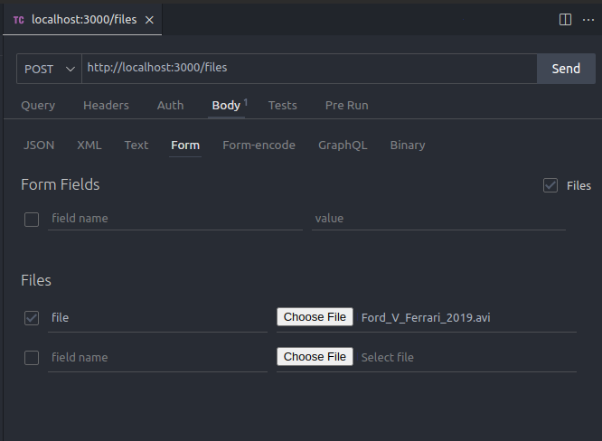
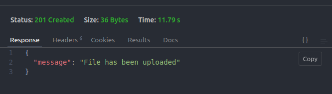

<p align="center">Тестовое в компанию САТЕЛ <p align="center">

## Задание

Создать бекенд на NestJS. Добавить Swager. Добавить метод на загрузку файлов большой емкости. Убрать CORS

## Решение

`Создать бекенд на NestJS`:

[дока](https://docs.nestjs.com/)

`Добавить Swager`:

[ресурс](https://docs.nestjs.com/openapi/introduction#bootstrap)

`Убрать CORS`:

[ресурс](https://docs.nestjs.com/security/cors)

`Добавить метод на загрузку файлов большой емкости`:

[ресурс 1](https://metanit.com/web/nodejs/10.1.php)
[ресурс 2](https://docs.nestjs.com/techniques/file-upload)
[ресурс 3](https://github.com/nestjs/nest/tree/master/sample/29-file-upload)
[ресурс 4](https://gabrieltanner.org/blog/nestjs-file-uploading-using-multer/)

## Инструкция по использованию:

1. Склонировать репо

По ssh

```bash
$ git clone git@github.com:vivishko/satel-test-solution.git
```

По https

```bash
$ git clone https://github.com/vivishko/satel-test-solution.git
```

2. Установить зависимости

```bash
$ npm install
```

3. Запустить проект

```bash
$ npm run start
```

4. Сделать запрос к localhost любым доступным способом

Например, командой curl запрос будет выглядеть так:

`curl -X POST http://localhost:3000/files -F "file=@/path/to/your/file/filename.ext"`

Другой пример:
создание запроса, используя расширение для VSCode 'Thunder Client' - аналог Postman.

Во вкладке Body заходим в раздел Form. Чтобы появилась возможность выбирать файлы, ставим галочку на Files. Затем пишем название переменной `file` и выбираем файл



Успешный результат выглядит следующим образом:



В коде обработаны некоторые ошибки, например `400 No file provided` в случае отсутствия файла для записи и `500 Upload failed` в случае ошибки в процессе записи.

